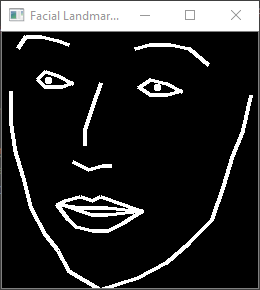
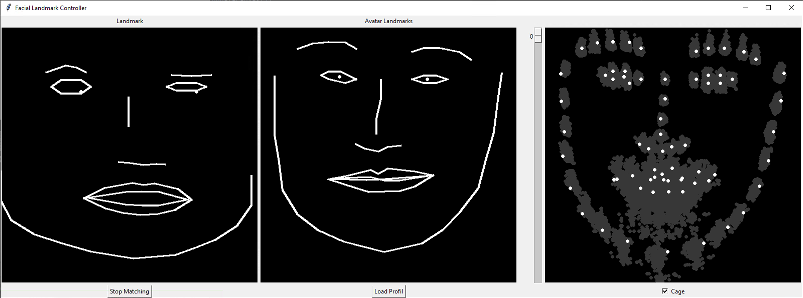

# Facial-Landmark-OSC-Client

## Requirements
1. `pip install -r requirements.txt`
2. Install [PyTorch](https://pytorch.org/get-started/locally/)
3. `pip install face-alignment`

## Capture Control

## Facial Landmark Controller
The Facial Landmark Controller offers the possibility to apply the relative input movement to an facial landmark set from the dataset. This improves the result if the avatar of one person is controlled by another person or the landmarks come from different sources and have to be merged.

**How to use the Facial Landmark Controller:**

1. Press Load Profil to load all facial landmarks to the Facial Landmark Controller. (Landmark.txt from [RGBD-Face-Avatar-GAN](https://github.com/Alpe6825/RGBD-Face-Avatar-GAN))

2. Choose a suitable facial landmark set with the slider on the right.

3. Try to imitate the chosen facial expression as well as possible.

4. Press Start Matching. The relative* input movement will now apply to the the chosen facial landmark set and the resulted heatmap will send to the GAN.

5. The option "cage" allows only positions from the dataset for each landmark.

*(relative to the face expression when the button is pressed)

